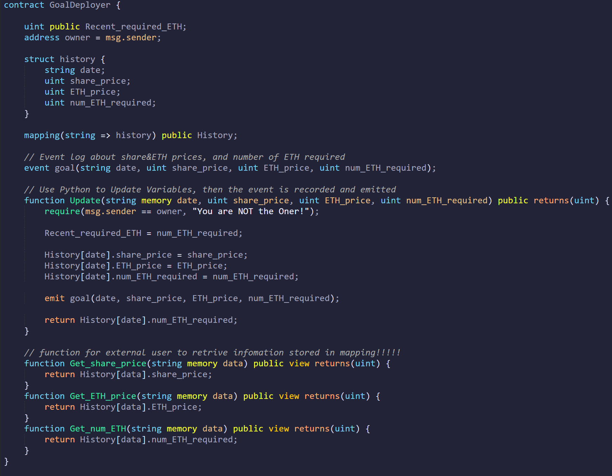
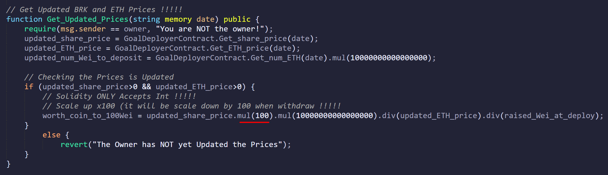
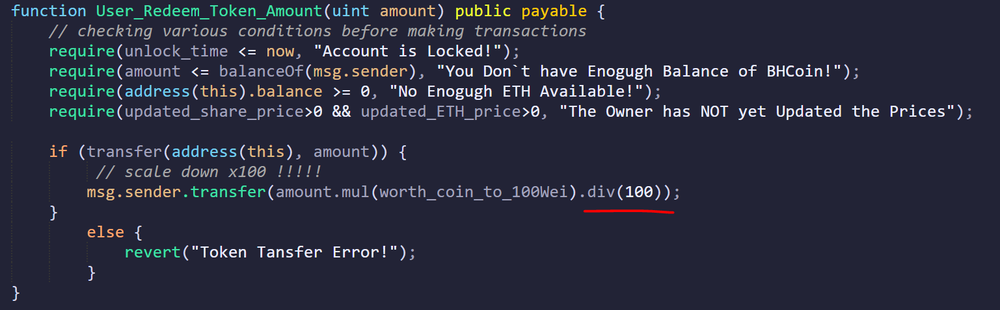

# **Project 3**

## **Background & Introduction:**

BHCoin is a ERC20 token.

 

## **Files:**
* [Project3.sol](Project3.sol) 
* [Project_3.ipynb](Project_3.ipynb) 
* [GoalDeployer.json](GoalDeployer.json) 
* [BHCoinSale.json](BHCoinSale.json) 

 

## **Installation:**
!pip install yfinance

!pip web3

 

## **Instructions:**

# **[Full Demo](https://www.youtube.com/watch?v=NoqC6PsxA_U&ab_channel=VincentG)**

 

### **Step 1: Extract Prices from Yahoo Finance & Update the Required Number of ETH for Crowdsale:**

a. Deploy the `Goal Deployer` contract, Copy & Paste the addresses to the Py file, `BHCoinSaleDeployer` and `BHCoin` contracts.

b. Call Yahoo Finance API to retrive financial data and Push the data to `Goal Deployer`.

 

### **Step 2: Deploy BHCoin Crowdsale Deployer & Open the BHCoin Crowdsale:**

a. Input the coin name, symbol, and owner wallet address (the beneficiary of this crowdsale).

b. The up-to-date required number of ETH for this crowdsale is recorded and reflected in this deployer contract.

 

### **Step 3: Make Testing Purchase:**

a. Open `BHCoinCrowdsale` contract by using the address of BHCoin Crowdsale contract as well as its compiled file.

b. For testing purpose, the open time for this crowdsale is **3 minutes**.

c. Using Account A and Account B to make the testing purchase of the BHCoin.

d. After the crowdsale target is met and 3 minutes, the owner can then finalise the crowdsale, and the proceeds will be trasfered to owner's wallet address.

e. Users can then check their BHCoin balance in this contract and withdraw their tokens (BHCoins).

 

### **Step 4-a: For Owner: Using the Crowdsale Proceeds to Purchase BRK Stock via Alpaca:**

a. Use the code in Py file to call our `BHCoinCrowdsale` contract,  retrive and check the status 1) is the crowdsale finalised 2) how much ETH is rasied.

 
 

 

### **Step 4-b: For Users: Add the BHCoin to Wallet:**

a. Open `BHCoin` contract by using the address of BHCoin contract as well as its compiled file.

b. Then Users can check their BHCoin balances and add the token to their MetaMask.

 

### **Step 5 Redeem the Tokens:**

a. Assuming **one year** has past. Owner will firstly use the API of Yahoo Finance to retrive the BRK & ETH Prices, and update the `Goal Deployer` (same as step one).

   `For the testing purpose, we will assume the prices of BRK and ETH prices on 2022/5/1`. 

b. Then the required number of ETH is calculated and updated, so that owner will deposit back these amounts of ETH back to the `BHCoin` contract for user to redeem.

c. We `allow 365 days to redeem`, for testing, we have set the `time lock to 2 seconds` after the price is updated.

d. Users (`testing account A & B`) then can redeem their BHCoin (token) back and withdraw ETH.

e. The owner can check if all tokens has been redeemed. If there is any ETH remains in the contract, the owner can withdraw them after 365 days (2 seconds for testing purpose).

f. Then check the ETH balance. If it is zero, the whole crowdsale cycle is completed.

 

## **Difficulties Encountered:**

1. Since the smart contract is runing on `Ethereum Virtual Machine (EVM)`, we have to deploy the `Goal Deplyer` contract first to allow the interaction with Python commands, that enables Python to push new information to the blockchain.

2. Due to the similar reason above. To commincate and extract information of one smart contract to another, we have to call the mapping to retrive any information stored in the `struct' of the other contract.

 

3. Smart contract  only accepts integer, and ignare any digits after the decimal. We have to scale up the excahnge rate by x100, and scale down at the end. (ie. the rate of the token to 100 wei rather to 1 wei.) 

 

## **Suggestions:**

1. During this one-year lock-up period, although users cannot redeem their BHCoin, they could write their own auction contract to sell their tokens.

    **In such auction contract, user can call the `Transfer` function in `BHCoin` contract to sell their coins.**

2. Even though we are following ERC20 and Crowdsale Solidity Contract Standards, implementing safe-math, and using `require` statement to check various conditions, the **vulnerability** of our contract still needs to be carefully examed before launch to the main-net.

