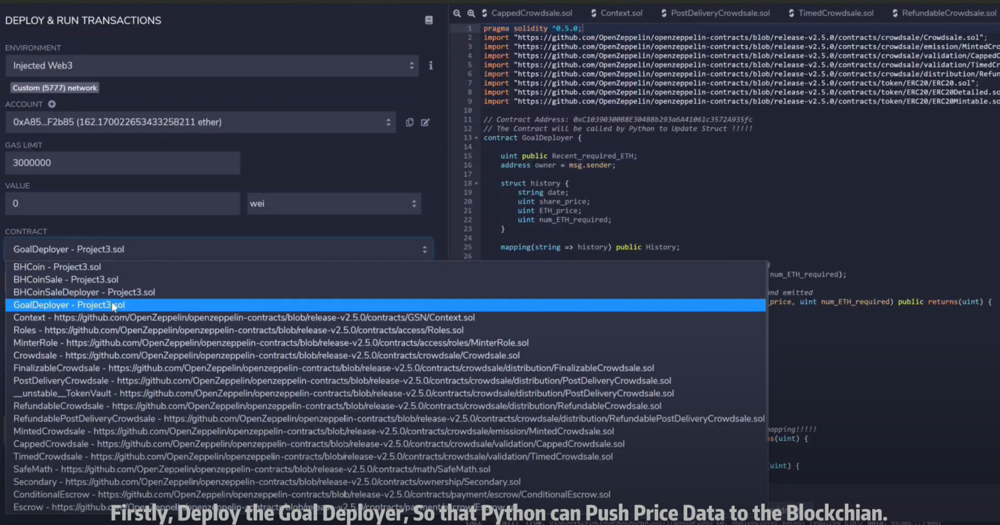
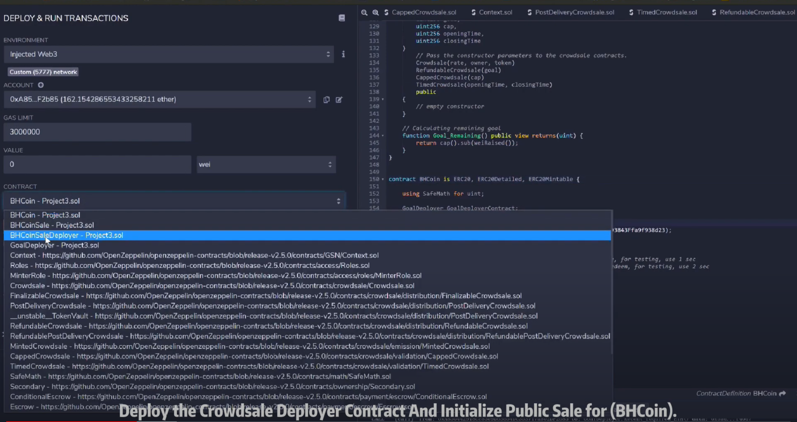
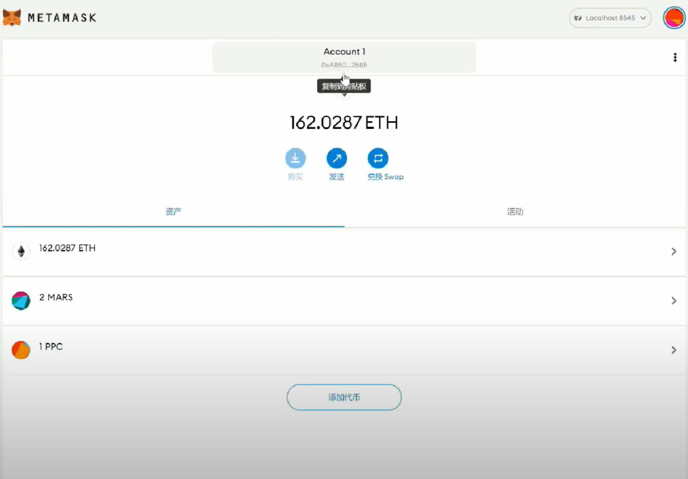
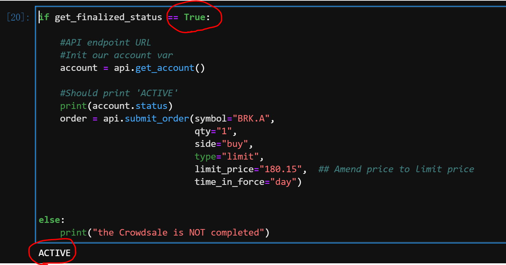
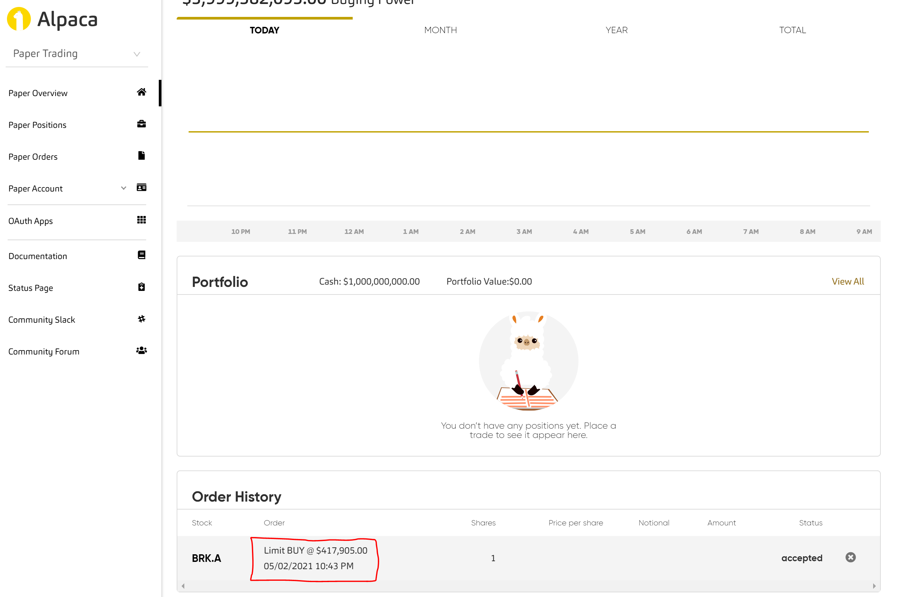
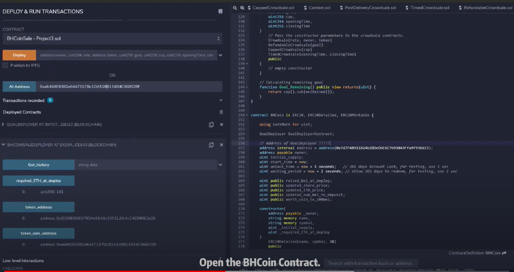
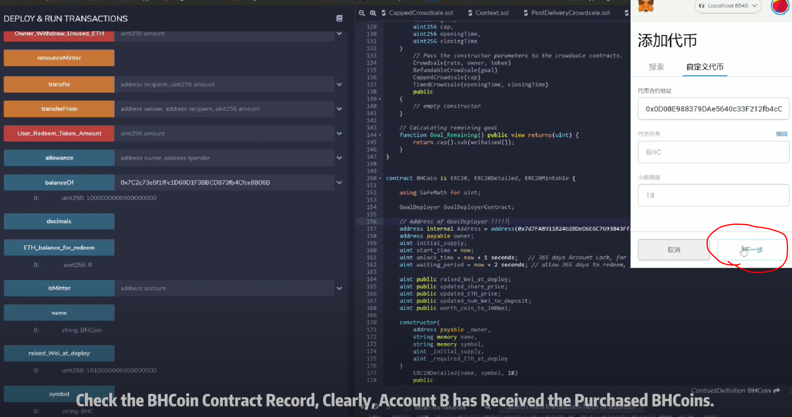

# **Project Name:** Making Valuable Assets Accessible

## **Background & Introduction:**

The proof of concept used in this project is to tokenize an "expensive" stock such as BRK.A (Berkshire Hathaway stock) into ERC20 Tokens (BHCoin), and allow the public to purchase a fraction
of BRK.A share, similar as to what Berkshire did with BRK.B, though with the user controlling the variables.

The Yahoo Finance API is called to extract price infomation (BRK.A and ETH) and then pushes the updated prices to the smart contracts. 
Participants will purchase the BHCoin according to this updated exchange rate.

When the Crowdsale is finalized, the owner can use the proceeds to place a trade of BRK.A via Alpaca API. After e.g. a one-year lock-up period, participants could
redeem their BHCoin token back to ETH at a updated exchange rate.

 

 

## **Files:**

- [Project3.sol](Project3.sol)
- [Project_3.ipynb](Project_3.ipynb)
- [GoalDeployer.json](GoalDeployer.json)
- [BHCoinSale.json](BHCoinSale.json)

 

## **Addtional Installation:**

1. !pip install yfinance
2. !pip install alpaca_trade_api

 

## **Instructions:**

# **[Full Demo](https://www.youtube.com/watch?v=NoqC6PsxA_U&ab_channel=VincentG)**

 

### **Step 1: Extract Prices from Yahoo Finance & Update the Required Number of ETH for Crowdsale:**

a. Deploy the `Goal Deployer` contract, Copy & Paste the addresses to the Py file, `BHCoinSaleDeployer` and `BHCoin` contracts.

b. Call Yahoo Finance API to retrive the financial data and Push the data to `Goal Deployer`.

 

### **Step 2: Deploy BHCoin Crowdsale Deployer & Open the BHCoin Crowdsale:**

a. Input the coin name, symbol, and owner wallet address (the beneficiary of this crowdsale).

b. The 'up-to-date' required number of ETH for this crowdsale is recorded and reflected in this deployer contract.

 

### **Step 3: Make Test Purchase:**

a. Open `BHCoinCrowdsale` contract by using the address of BHCoin Crowdsale contract as well as its compiled file.

b. For test purposes, the open time for this crowdsale is set to **3 minutes**.

c. Use Account A and Account B to make the test purchases of the BHCoin.

d. After the crowdsale target is met and 3 minutes has lapsed, the owner can then **finalise** the crowdsale, and the proceeds will be transfered to owner's wallet address.

e. Users can then check their BHCoin balance in this contract and withdraw their tokens (BHCoins).

 

### **Step 4-a: For Owner: Using the Crowdsale Proceeds to Purchase BRK Stock via Alpaca:**

a. Use the code in Py file to call our `BHCoinCrowdsale` contract, retrive and check the status:

1) is the crowdsale finalised? 

2) how much ETH is rasied?

 

 

### **Step 4-b: For Users: Add the BHCoin to Wallet:**

a. Open `BHCoin` contract by using the address of BHCoin contract as well as its compiled file.

b. Then Users can check their BHCoin balances and add the token to via MetaMask.

 

### **Step 5 Redeem the Tokens:**

a. Assuming **one year** has past, the Owner will firstly use the Yahoo Finance API to retrive the BRK.A & ETH Prices, then update the `Goal Deployer` (same as step one).

`For testing purposes, we will assume the prices of BRK.A and ETH prices on 2022/5/1`.

b. Then the required number of ETH is calculated and updated, so that the owner will deposit back these amounts of ETH back to the `BHCoin` contract for user to redeem.

c. We `allow 365 days to redeem`, for testing, we have set the `time lock to 2 seconds` after the price is updated.

d. Users (`testing account A & B`) can then redeem their BHCoin (token) back and withdraw ETH.

e. The owner can check if all tokens have been redeemed. If there is any remaining ETH in the contract, the owner can withdraw them after 365 days (2 seconds for testing purpose).

f. Then check the ETH balance. If it is zero, the whole crowdsale cycle is completed.

 

### **Step 6: FrontEnd Setup:**

The Front-End interface is a browser based application built on HTML. Users would be able to purchase tokens for BHC using the interface.
The interface can be loaded using **Python** or **Node.js** .

**Python Setup**

1. Go to /Project-3/frontend folder using GitBash or Terminal
2. Type **python -m http.server 8000 to load the server**
3. In your browser type http://localhost:8000/

**Node.js Setup**

1. Install node.js from the following location - [node.js](https://nodejs.org/en/download/)
2. Use GitBash or Terminal to go to /Project-3/frontend
3. type **node server.js**
4. In your browser type http://localhost:8080/

 

## **Difficulties Encountered:**

1. Since the smart contract is runing on `Ethereum Virtual Machine (EVM)`, we have to deploy the `Goal Deplyer` contract first to allow the interaction with Python commands, that enables Python to push new information to the blockchain.

2. Due to the similar reason above, to commincate and extract information from one smart contract to another, we have to call the mapping to retrive any information stored in the `struct' of the other contract.

 

3. Smart contracts only accepts integers, and ignore any digits after the decimal, therefore, we have to scale up the exchange rate by x100, and scale down accordingly. (i.e. the rate of the token to 100 wei rather to 1 wei.)

 

## **Suggestions:**

1. During this one-year lock-up period, although users cannot redeem their BHCoin, they could write their own auction contract to sell their tokens.

   **In such an auction contract, the user can call the `Transfer` function in `BHCoin` contract to sell their coins.**

2. Even though we are following ERC20 and Crowdsale Solidity Contract Standards, and have implemented safe-math, and used `require` statements to check various conditions, the **vulnerability** of our contract still needs to be carefully examined before launching to the Ethereum Mainnet.

